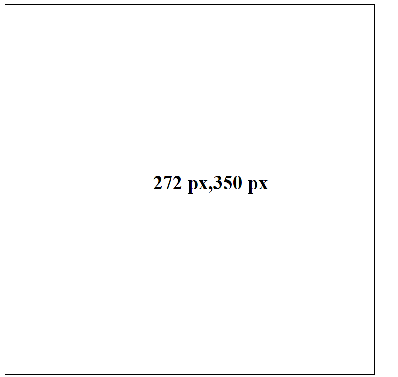

# VueJS - Realtime Cursor Tracker
This project is a VueJS based cursor tracker which updates on realtime and displays the position coordinates.

## Installation
Clone the repo and open the app.html file in browser.

## Usage

## Contributing
Pull requests are welcome.
Please make sure to update tests as appropriate.

## License
[MIT](https://choosealicense.com/licenses/mit/)
